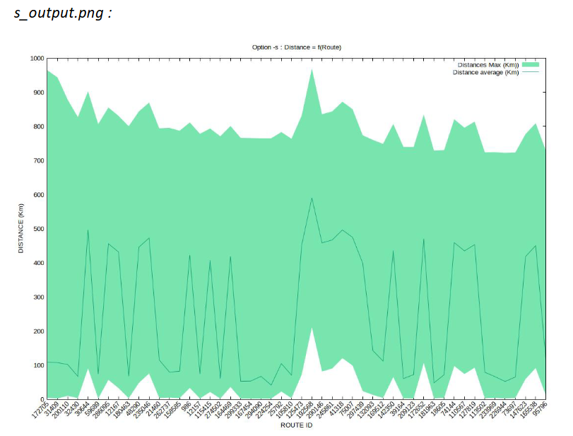
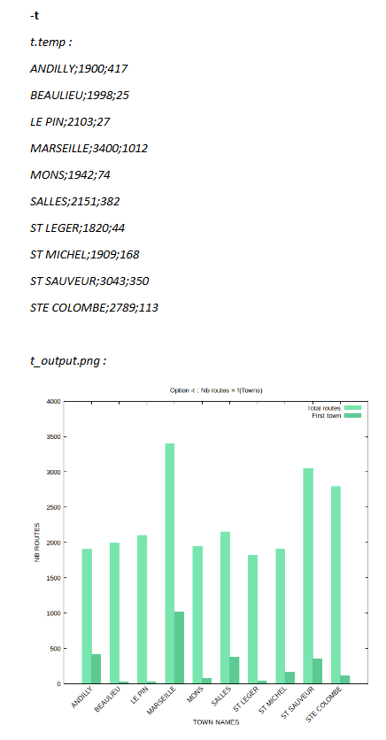

# Cy-Truck

Cy-Truck is a collection of scripts and tools to sort, visualize and generate charts from CSV data. The project provides a main script `graph_sort.sh` and compiled utilities in `progc/` to speed up certain operations.

## ⚙️ Short description (for GitHub)

Shell and C utilities to process and visualize CSV files: chunking, sorting, and automated image/chart generation.

## 🚀 Key features

- Process and chunk large CSV files for faster handling
- Generate images and charts (via ImageMagick and gnuplot)
- Customizable sorting and analysis options in `graph_sort.sh`
- Compiled C utilities in `progc/` (`s_progc`, `t_progc`) for fast operations

## 📦 Requirements

- OS: Linux or macOS
- Tools:
  - ImageMagick
  - VLC (for optional video output/processing)
  - gnuplot
  - make and gcc (to compile utilities in `progc/`)

Quick install examples:

Mac (Homebrew):

    brew install imagemagick
    brew install --cask vlc
    brew install gnuplot

Ubuntu/Debian:

    sudo apt update
    sudo apt install imagemagick vlc gnuplot build-essential

## 🔧 Installation and build

1. Clone the repository:

    git clone https://github.com/NayJi7/cy-truck.git
    cd cy-truck

2. Build the C utilities (from `progc/`):

    cd progc
    make

The `Makefile` includes targets `s_progc`, `t_progc` and `clean`.

## ▶️ Usage

General usage:

    ./graph_sort.sh [FILE.csv] [OPTIONS]

Useful options:
- `-h`, `--help`: show help and available options
- `-t`, `-s`: example options handling different sorting/visualization modes (see help)

Behavior:

The script checks for the existence of `temp/` and `pictures/` directories. If present, temporary contents are cleaned; otherwise they will be created with normal user permissions.

The script splits the CSV file into chunks (`temp/*.temp` or `temp/*_data.temp`) to handle large datasets more efficiently.

## 📁 Repository structure

- `graph_sort.sh`: main processing script
- `progc/`: C utilities and `Makefile` (targets: `s_progc`, `t_progc`, `clean`)
- `data/README/`: example output images (e.g. `t.png`, `s.png`)

## 🧪 Quick test

1. Place a small test CSV file (e.g. `test.csv`) at the repository root.
2. Run:

    ./graph_sort.sh test.csv

Check the `temp/` and `pictures/` folders for intermediate files and generated images.

## 📝 Notes

- The original data used for demonstrations was lost, but examples are available in the project report here: [project report](https://github.com/NayJi7/cy-truck/blob/main/Group_review.pdf).
- If you want to produce video output or work with multimedia, ensure VLC is installed and accessible from the command line.

## 👥 Team

## 🎓 Grade

Final grade obtained for the project presentation: 17/20